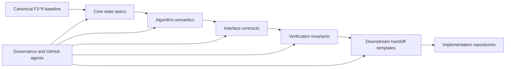

# ASH Pattern System Wiki

The ASH Pattern System repository is the canonical, platform-neutral specification baseline for resilient software semantics.

## Canonical Status Snapshot

| Area | Status |
|---|---|
| Math baseline | Canonical and aligned to `F2^9` |
| Core semantics | Active canonical layer |
| Contracts and verification | Active conformance layer |
| Governance and GitHub agents | Active enforcement layer |
| Downstream handoff templates | Active delivery layer |
| Main repository mode | Maintenance mode (canonical corrections and governance upkeep) |

## Architecture At A Glance

## Start Here

| If you need to... | Open this page |
|---|---|
| Onboard quickly and read in the right order | [Getting Started](Getting-Started) |
| Understand the canonical 9-bit / `F2^9` math baseline | [Canonical Math Baseline](Canonical-Math-Baseline) |
| Navigate all specs by layer | [Specification Layers](Specification-Layers) |
| Understand recovery, fallback, containment, and safe halt | [Recovery and Safety Semantics](Recovery-and-Safety-Semantics) |
| Implement against contracts and prove conformance | [Contracts and Verification](Contracts-and-Verification) |
| Understand governance and CI sentinels | [Governance and Agents](Governance-and-Agents) |
| Build downstream repositories from canonical handoff templates | [Downstream Handoff Guide](Downstream-Handoff-Guide) |
| Maintain this wiki and keep it current | [Wiki Maintenance Playbook](Wiki-Maintenance-Playbook) |
| Decode canonical terminology quickly | [Glossary](Glossary) |

## Canonical Guardrails

1. Main is canonical semantics, not implementation code.
2. Full 9-bit state space (`F2^9`, i.e. 9-dimensional over F2) is canonical.
3. Canonical transition is XOR-by-codeword (`x' = x XOR c`).
4. Branching is first-class.
5. Diagnostics are mandatory across detection, recovery, escalation, and terminal halt.
6. Planner/emitter materialization boundary is locked.

## Primary Source Documents

- [README.md](https://github.com/flynn33/ASH-Pattern-System/blob/main/README.md)
- [docs/03-design-roadmap.md](https://github.com/flynn33/ASH-Pattern-System/blob/main/docs/03-design-roadmap.md)
- [specs/core/codeword-set.pseudo.md](https://github.com/flynn33/ASH-Pattern-System/blob/main/specs/core/codeword-set.pseudo.md)
- [specs/interfaces/semantic-contracts.md](https://github.com/flynn33/ASH-Pattern-System/blob/main/specs/interfaces/semantic-contracts.md)
- [specs/verification/invariant-spec.md](https://github.com/flynn33/ASH-Pattern-System/blob/main/specs/verification/invariant-spec.md)
- [governance/github-agents-governance.md](https://github.com/flynn33/ASH-Pattern-System/blob/main/governance/github-agents-governance.md)
