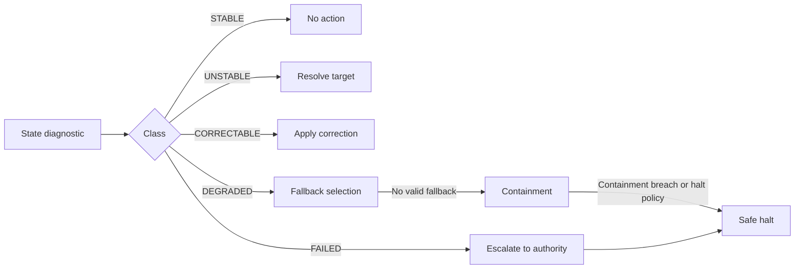

# Recovery and Safety Semantics

The ASH Pattern System is resilient because it defines deterministic behavior for recovery, fallback, containment, and terminal halt.

## Canonical System-State Classes

| Class | Meaning | Action category |
|---|---|---|
| `STABLE` | Well-formed state allowed by validated context | `NO_ACTION` |
| `UNSTABLE` | Same-orbit stable candidates exist, but policy cannot select exactly one target | `TARGET_RESOLUTION_REQUIRED` |
| `CORRECTABLE` | One same-orbit target and one correction codeword are selected | `APPLY_CORRECTION` |
| `DEGRADED` | No same-orbit correction target is available or correction validation failed | `FALLBACK_REQUIRED` |
| `CONTAINED` | Restricted mode to prevent propagation | `CONTAINMENT_ACTIVE` |
| `FAILED` | No automated recovery path | `EXTERNAL_ESCALATION_REQUIRED` |
| `SAFE_HALT` | Intentional terminal state | `TERMINAL_NO_RECOVERY` |

Classification requires well-formed input plus a validated operational context. Malformed input receives an input-validation diagnostic and no system-state class.

## Deterministic Escalation Flow

*Caption: structural normalization happens before this flow and never mutates state. `UNSTABLE` blocks mutation until target policy resolves; `CORRECTABLE` applies exactly one same-orbit codeword.*

## Required Recovery Properties

1. Deterministic class-to-recovery mapping.
2. No silent healing.
3. Fallback only through canonical registry policy ordering.
4. Monotonic escalation unless an external authority records a policy-permitted resolution.
5. SAFE_HALT is terminal and non-reversible.

## Diagnostic Chain Requirement

Every stage must emit diagnostics conforming to:

- Shared envelope (`specs/interfaces/diagnostic-schema.md`)
- Canonical rule-ID taxonomy (`specs/interfaces/rule-id-taxonomy.md`)

## References

- `specs/core/state-validity-diagnostics.pseudo.md`
- `specs/core/system-state-classification.pseudo.md`
- `specs/core/recoverability-semantics.pseudo.md`
- `specs/algorithms/recovery-fallback-semantics.pseudo.md`
- `specs/algorithms/containment-safe-failure-semantics.pseudo.md`
